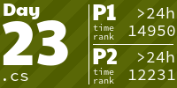
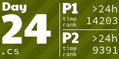

# AdventOfCode
My solutions for Advent Of Code. 

## Data
Data is stored in a private repository and can be loaded via
* git clone <URL to solutions repo>
* git submodule init
* git submodule update

<!-- AOC TILES BEGIN -->
<h1 align="center">
  2024 - 16 ⭐ - Smalltalk
</h1>

<!-- AOC TILES END --> 
<h1 align="center">
  2021 - 2 ⭐
</h1>

<h1 align="center">
  2022 - 16 ⭐
</h1>

<h1 align="center">
  2023 - 50 ⭐
</h1>

